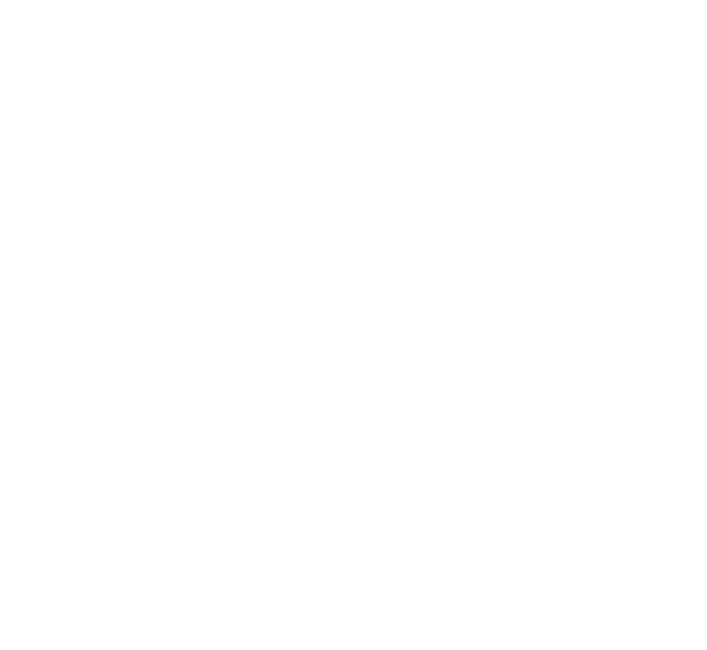

DBD-Ant

[简介](#简介)
[资源](#资源特性)
[细节](#产品细节)
[尺寸](#机械尺寸)
[布局](#接口布局)
[接线](#接线)
[模式](#运行模式)
[分析](#优劣分析(与传统步进电机对比))
[软件](#调试软件)
[开发](#开发者)
[教程](#图文教程)
[视频](#videos)

## Ant4

---

### 简介

---


Ant是DBD团队开发的一款超小型创客神器,尺寸只有50mm x 30mm x 9mm, 它采用ARM Cortex-M3内核的32位处理器, 主频72MHz, 配备TOSHIBA的双全桥驱动IC,
运行空间矢量控制算法及动态力矩调节算法, 可以完美控制42 35 28 20等型号步进电机.  
Ant小巧精致, 接口丰富, 可直接通过USB连接进行编程控制, 也可通过CAN总线进行控制. 自带网关算法, USB与CAN协议互通,不需要额外购买协议转换器.
拥有2个IO接口,一路输入IO,一路输出IO.  
Ant支持Windows,Linux,Android,Mac系统,支持PC,树梅派,Ardunio等平台(需USB或CAN接口),接口协议开放. 用户可以使用C/C++ Python Matlab
以及易语言进行二次开发.  
Ant4是第4代产品,在接口,易用性和稳定性等方面都达到了近乎完美的平衡.

---

### 资源特性

---

|  |  |
| --- | --- |
| 重量: | 32g |
| 电机: | 4线2相步进电机 |
| 细分: | 250细分 |
| 工作电压: | 5V-15V(推荐12V) |
| 最大持续输出电流: | 1.5A |
| PWM频率: | 50KHz |
| 输入IO: | 1路 (3.3V-15V触发) |
| 输出IO: | 1路 (开漏输出500mA) |
| USB串口: | CH340E@1.5Mbps |
| CAN总线: | TJA1050A@1Mbps |
| 运行温度: | -10 to +60摄氏度 |

---

### 产品细节

---


---

### 机械尺寸

---




---

### 接口布局

---

如图,电源和电机接口采用2P和4P的XH2.54标准接插件,CAN总线接口采用两个SH1.0-2P的标准接插件,输入输出IO分别采用SH1.0-3P
和SH1.0-2P的接插件.USB接口在上面,采用MicroUSB接口.


|  |  |
| --- | --- |
| 电源接口 | 采用XH2.54-2P标准接插件，供电电压DC12V,有防反接保护，电源正负极接反不会烧毁. |
| 电机接口 | 采用XH2.54-4P标准接插件,适用２相４线步进电机．对于市场上常见的3D打印机用的42步进电机可以直接使用. 如有需要自己接线的，请参考电机的引线说明，注意线序． |
| CAN接口 | 采用两个SH1.0-2P标准接插件，内部互联．连接时注意区分CAN-H和CAN-L,推荐使用双绞线， 另外，2台以上级联时需要在第一台和最后一台加120欧母终端电阻． |
| IO输入接口 | 即传感器接口，采用SH1.0-3P标准接插件，提供12V对外供电，内部下拉10k电阻，可以接的传感器包括物理开关，物理按键，光电开关，霍尔开关等． |
| IO输出接口 | 采用SH1.0-2P标准接插件，内部采用MOS管开漏输出，可以承受500mA的输出电流，可以用来接电磁继电器，小型直流电机，散热风扇，电磁刹车等． |
| USB接口 | 采用MicroUSB标准接插件,内置USB串口芯片．使用时注意选优质USB数据线，区别于USB充电线(不能通信). |

---

### 接线

---


---

#### 注意细节1：电源线的正负极

##### 注意电源正负极以及电源供电电压，超压会导致驱动器烧毁，反接不会。

---

#### 注意细节2：电机线的线序

##### 依次为A+A-B-B+,其中A+A-为一组,B-B+为一组.接错或者接反会出现电机抖动，不动等现象

---

#### 注意细节3：CAN线的线序

##### 组网时H接H，L接L。并且在CAN网络的第一个和最后一个节点加入120欧母电阻。线材优先选用双绞线，长距离通信时对线材要求极高，推荐使用CAN总线专用线材。

---

#### 注意细节4：回零传感器的线序

##### 12V/GND为供电口，如接霍尔或者光电传感器时需要供电，传感器类型需要选择能输出高电平信号的PNP输出方式。如果只接2脚的触碰开关，则只需接12V/IN即可，因为内部有下拉电阻作为负载。 对于传感器的常开常闭没有要求，可以通过修改*--回零电平--*这个参数进行匹配。


---

#### 注意细节5：IO输出接口

##### IO输出接口最大负载500mA，可带光偶/继电器/小型电磁铁/小型直流电机/灯珠等，大负载使用请接继电器。

---


---

### 运行模式

---

|  |  |
| --- | --- |
| 位置模式(常用) | 位置模式,全称平滑位置模式.通常称为点位运动.根据设定的目标位置,目标速度以及加速时间 自行规划位置时间曲线并开始运动.  位置模式常用API及参数：    速度－时间曲线：    API使用流程示意图： |
| 速度模式 | 速度模式,全称平滑速度模式,根据设定读目标速度和加速时间自行规划速度时间曲线并开始运动. 该模式的控制对象是电机的运行速度,不关心电机的位置. |
| 回零模式(坐标原点) | 进入回零模式后,根据设定的回零方向和目标速度开始运动,直到传感器触发,达到设置回零电平参数后停止运行, 并且自动将运行模式恢复为进入回零模式前的运行模式.若在进入回零模式前，传感器的触发电平已经处于触发状态，则进入回零模式后， 直径清零当前位置，并恢复为之前的运行模式，整个回零过程不会运动. |
| 插补模式 | 插补模式全称同步位置插补模式,用于实现最多16轴电机的同步插补运动.该模式通常用于3D打印机,写字机,画图机,雕刻机, 点胶机等需要多轴联动,并且执行连续轨迹的设备. |
| 气缸模式(待开发，需要请联系技术支持) | 气缸模式用于模拟气缸的控制方式，通过输入IO接口的电平，来控制电机的转动位置，即高电平电机运动到位置Ｐ１， 低电平电机运动到位置Ｐ２，运动过程的加速时间和运行速度等参数均可设置并保存．可以选择配合回零传感器定位起始位置． |

---

### 优劣分析(与传统步进电机对比)

---

#### 劣势

|  |  |
| --- | --- |
| 转速 | 由于供电电压限制,电源供电额定12V,最高15V. (较24V/48V供电的驱动在最大运行速度上处于劣势), 大部分42步进电机, 额定转速200RPM, 最大300RPM.部分优质电机空载转速可以达到2000RPM.如果对转速有要求,推荐在步进电机选型时选择低电压,低电感量的高速电机. |
| 力量 | 电机的最大输出力矩与电流成正比,Ant负载运行电流额定1.5A,最大2A.与其他大功率的驱动器相比,力量输出上处于劣势. |
| 散热 | 因体积较小, 虽已加入上下两个表面的散热铝板, 在持续大电流连续工作时需做好散热.(传统工业级驱动器壳体较大, 散热面积也非常大, 通常不需要额外考虑) |

#### 优势

|  |  |
| --- | --- |
| 体积 | Ant体积只有50mm x 30mm x 9mm, 远小于传统步进驱动器. |
| 细分 | 采用250细分, 运动更平滑, 噪音更小.(传统驱动器细分数一般在8,16或者32, 高级的驱动器可以做到64,128甚至256细分) |
| 热量控制 | 采用动态参数控制(在加速减速阶段增加力矩, 在静止时减少力矩), 降低发热量, 提升效率.(传统驱动器不能动态调节, 所以需要大型散热片) |
| 散热 | 外壳采用6061铝, 提升导热能力, 用户可将本产品固定在其他金属表面, 以获得更好的散热效果, 除此之外, 还提供散热风扇的强力散热方案. |
| 通信 | 采用USB和CAN总线作为通信接口, 接线更少, 更加灵活也更加稳定.(传统的驱动需要差分的使能信号,脉冲和方向信号,接线较多, 且容易受干扰) |
| 参数化控制 | 内部可调参数多达数十个, 可以匹配不同的电机, 也可根据用户需求实时进行在线调整.(传统驱动通过拨码开关或者旋钮提前设置好) |
| 开发 | USB串口可以适应绝大多数平台(x86 ARM等)的开发, 而且各种语言对串口的支持都相当到位, 资料也非常齐全, 用户可以很快上手. CAN总线可以级联, 也可以接入用户的主控, 进行高速高效实时的控制.(传统控制器需要额外的控制器才能开发) |
| 运行模式 | 内置多种的运行模式, 方便用户针对不同的应用场景. 并且内置运动规划器, 用户只需一条指令, 便可实现平滑的点位运动.(传统控制器需要额外的控制器才能开发) |
| 插补模式 | 支持插补模式, 用户可通过插补模式实现多轴联动同步控制. |

#### 改善措施

|  |
| --- |
| 1.针对供电电压, 我们已经推出下一代驱动板[Bee](#Bee), 供电电压8V-30V,实现高转速. |
| 2.针对电流, 下一代驱动板[Bee](#Bee), 额定电流3A, 最大4A, 实现大力距. |
| 3.针对散热, 搭配全铝散热外壳, 用户可根据实际需要选择. |

Note:欢迎新老顾客提出问题, 我们将在新的产品中满足您的需求.

---

### 调试软件

---

#### 软件下载

##### 调试软件下载链接

[Ant调试软件(Windows)](downloads/StepperControlLatest.zip)  
[Ant调试软件(Linux)](downloads/Ant-x86_64.AppImage)  
[Ant调试软件(Android)](downloads/Ant-App.zip)

##### 驱动下载链接

[USB串口驱动(Windowns)](downloads/CH341SER.EXE)  
[USB串口驱动(Linux)](downloads/CH341SER_LINUX.ZIP)

#### 图文教程

##### 驱动安装

关于驱动安装,大部分Linux发行版(Ubuntu,Debian,Fedora等)都集成了驱动.可以直接使用.这里以Windows平台为例,
介绍驱动的安装方法:  
下载:  
  
安装:  
  
安装成功:  


##### 软件运行

下载并解压运行:  
  
打开界面如下,我们将依次介绍1-40号的功能描述:  
  
1.软件名称及版本.  
2.扫描端口,当USB插入电脑后,点击'扫描端口'即可在3中列出电脑上所有的可用USB端口.  
3.端口列表,点击下拉菜单可选取对应端口.  
4.打开/关闭端口.端口选好之后,点击打开,开始通讯.点击关闭,断开通讯.  
5.扫描设备.默认打开端口后会自动进行一次扫描.也可手动进行扫描.  
6.当前设备.显示当前操作的设备编号,点击下拉菜单可以选择其他编号.  
7.全部设备.绿色的代表能够扫描到的设备,可以直接点击切换当前设备.  
8.状态信息,通讯连接状态.可用来判断是否通讯正常.  
9.状态信息,使能状态.可用来判断电机处于使能状态,还是失能状态.  
10.状态信息,到位状态.可用来判断电机是否运行到位.  
11.状态信息,按键状态.可用来判断按键是否按下.  
12.状态信息,输入IO.可用来判断输入传感器(回零传感器)的状态.  
13.状态信息,目标位置.可用来观察电机的目标位置.  
14.状态信息,当前位置.可用来观察电机的实时运行位置.  
15.批量修改参数功能.勾选后,指定起始ID和结束ID,可批量修改ID区间的设备参数.  
16.修改ID功能.勾选后,可以进行ID修改.注意,修改的是当前设备的ID,目标ID不能和现有其他ID相同,否测会出现网络里ID重复.确认修改
之后,会自动切换到新的ID号,这时,如果需要永久保存这个修改,请点击29保存参数,否则断电后会恢复之前的ID.  
17.设备参数,运行电流.区别于保持电流,是指电机在运动过程中的电流大小.  
18.设备参数,保持电流.区别于运行电流.是指电机在静止状态的电流大小.降低静止时的电流可以有效的降低发热量.  
19.设备参数,运行到保持时间.电机从运行状态到静止保持状态切换时,增加一些时间运行较大的电流(运行电流),延迟这个时间后再切换
到保持电流,可以提高电机的稳定性.  
20.设备参数,回零方向.在回零模式下,电机的运动方向.该方向应与回零传感器的安装方向一致.  
21.设备参数,回零电平.在回零模式下,传感器的触发电平.  
22.设备参数,加速时间.在速度模式下,该时间指从当前速度过渡到目标速度的时间.在位置模式下,该时间是指加减速过程的时间.  
23.设备参数,速度.在速度模式下,该参数是指目标速度.位置模式下,该参数是指运行过程中的最大速度.回零模式下,该参数是指回零速度.  
24.设备参数,运行模式.通常由位置模式,速度模式,回零模式,插补模式.  
25.设备参数,心跳频率.目前该参数已移除.
26.设备参数,CAN波特率.不同的波特率影响通信速度,和通信距离.波特率越高,通信速度越快,但是通信距离越短.  
27.参数操作,读取参数.点击后,将从设备中读取参数到软件界面.  
28.参数操作,更新参数.点击后,将软件界面的参数更新到设备中.  
29.参数操作,保存参数.点击后,将设备中的参数保存到设备的FLASH中,断电可以保存.  
30.设备参数,IO输出.控制IO输出.目前Ant设备仅有一个IO输出.  
31.设备参数,运动指令.由绝对位置指令,增量位置指令,速度指令.回车或者点击发送按钮将指令发送出去.  
32.设备参数,启动/停止.启动/使能电机控制后,电机开始受驱动控制.停止/失能电机控制后,电机不收控制,可自由转动.可用于手动调整.  
33.设备参数,回零.点击后,将切换运行模式为回零模式.  
34.多轴同步控制.该模式下,可先发送各个电机的目标位置,然后统一运动.可用与同步性要求高的场合.  
35.启动按钮.点击后进入同步位置模式,该模式区别于位置模式.该模式下,接收到同步位置指令后,电机不会立刻运动.  
36.发送目标位置,实际为发送同步目标位置.区别于目标位置.该参数接收后不会被立刻执行.  
37.发送同步运动指令.该指令为广播指令.总线上所有设备均可在同一时刻接收到.  
38.微信二维码.用于提供技术支持.  
39.固件升级.暂时不提供升级功能.  
40.固件选择.暂时不提供升级功能.

---

### 开发者

---

#### SDK下载

[
Python SDK](downloads/PythonSDK.zip)
[
Matlab SDK](downloads/DBD-Matlab.zip)
[
Android SDK](downloads/testDemo001.zip)
[
通信协议](#profile)


---

#### SDK接口

##### Python SDK接口说明

SDK接口分为4类,参数设置set类,参数获取get类,等待信号wait类,功能操作类,下面将做详细介绍.

|  |  |
| --- | --- |
| setPowerOn(id) | 设置对应id号的状态为使能,使能后电机开始受驱动器控制.使能后状态指示灯由快速闪烁变为慢速闪烁. |
| setPowerOff(id) | 设置对应id号的状态为失能,失能后电机不再受驱动器控制.失能后状态指示灯由慢速闪烁变为快速闪烁. |
| setTargetVelocity(id, value) | 设置目标速度.数值范围通常位1-300,单位pulse/ms近似等于RPM. |
| setTargetPosition(id, value) | 设置目标位置.Ant控制1.8度步进电机时,50000脉冲当量对应一圈. |
| setVelocityMode(id) | 设置运行模式为平滑速度模式,详细内容参考[运行模式](#operationmode) |
| setPositionMode(id) | 设置运行模式为平滑位置模式,详细内容参考[运行模式](#operationmode) |
| setHomingMode(id) | 设置运行模式为回零模式,详细内容参考[运行模式](#operationmode) |
| setHomingDirection(id, value) | 设置回零方向.取值为1或者-1. |
| setHomingLevel(id, value) | 设置回零电平.取值为1或者0. |
| setRunningCurrent(id, value) | 设置运行电流.取值范围100-1500,单位mA,通常300-800比较合理. |
| setKeepingCurrent(id, value) | 设置保持电流.取值范围100-1500,单位mA,通常300-800比较合理. |
| setAccTime(id, value) | 设置加速时间.在位置模式下或者速度模式下的加减速过程的时间,单位ms.通常100-2000比较合理. |
| setOutputIO(id, value) | 设置IO输出.取值0或者1. |
| getInputIO(id) | 获取输入IO的状态.返回值为0或者1. |
| getActualVelocity(id) | 获取当前的实际运行速度. |
| getActualPosition(id) | 获取当前的实际位置. |
| getTargetVelocity(id) | 获取目标速度. |
| getTargetPosition(id) | 获取目标位置. |
| getRunningCurrent(id) | 获取运行电流. |
| getKeepingCurrent(id) | 获取保持电流. |
| getAccTime(id) | 获取加速时间. |
| getHomingDirection(id) | 获取回零方向. |
| getHomingLevel(id) | 获取回零电平. |
| waitHomingDone(id) | 等待回零完成. |
| waitTargetPositionReached(id) | 等待目标位置到达. |
| getDeviceID(id) | 获取设备ID. |
| scanDevices() | 扫描在线设备. |
| saveParameters(id) | 保存参数. |
| changeID(id, value) | 修改ID.ID范围1-120. |

##### 如何使用Python SDK

###### 准备工作

1.安装pyserial.用户可以通过pycharm的库管理下载添加, 或者通过命令行添加, 有问题请联系我们或者自行搜索解决.  
2.桌面开发环境推荐使用PyCharm进行程序编写.  
3.终端开发环境,sudo python3 -m pip install pyserial
4.获取串口权限.Linux下的设备使用都需要使用sudo或root用户才能打开，为了能让普通用户也能使用串口，可以增加udev规则来实现，具体方法如下： sudo vim
/etc/udev/rules.d/70-ttyusb.rules 增加如下内容： KERNEL=="ttyUSB[0-9]\*",MODE="0666"
保存，重新插入USB转串口，普通用户就能搞定了.  
5.下载[Python SDK](#sdk).并拷贝到用户运行目录.

###### 代码运行

```

            
#!/usr/bin/python3

from DBDynamics import Ant
import time

def mainAnt():
    # Note: for Linux System Users, you can use "ls /dev/ttyU*" to find your port name
    # Note: for Windows System Users, portName='COM?', change ? to your COM number
    portName = '/dev/ttyUSB0'
    DBD = Ant(portName)

    # Your Code Start Here:
    DBD.setTargetPosition(8, -50000)
    DBD.waitTargetPositionReached(8)

    DBD.setTargetPosition(8, 50000)
    DBD.waitTargetPositionReached(8)

    # Close Communication
    DBD.stop()


if __name__ == '__main__':
    mainAnt()
            
        
```

##### Matlab SDK接口

DBD提供的m文件按功能分为3类,分别是:set类设置参数,get类获取参数,wait类等待信号.

|  |  |
| --- | --- |
| DBD\_setPowerOn(id) | 设置对应id号的状态为使能,使能后电机开始受驱动器控制.使能后状态指示灯由快速闪烁变为慢速闪烁. |
| DBD\_setPowerOff(id) | 设置对应id号的状态为失能,失能后电机不再受驱动器控制.失能后状态指示灯由慢速闪烁变为快速闪烁. |
| DBD\_setPositionMode(id) | 设置运行模式为平滑位置模式,详细内容参考运行模式 |
| DBD\_setVelocityMode(id) | 设置运行模式为平滑速度模式,详细内容参考运行模式 |
| DBD\_setHomingMode(id) | 设置运行模式为回零模式,详细内容参考运行模式 |
| DBD\_setRunningCurrent(id,value) | 设置运行电流.取值范围100-1500,单位mA,通常300-800比较合理. |
| DBD\_setKeepingCurrent(id,value) | 设置保持电流.取值范围100-1500,单位mA,通常300-800比较合理. |
| DBD\_setTargetVelocity(id,value) | 设置目标速度.数值范围通常位1-300,单位pulse/ms近似等于RPM. |
| DBD\_setTargetPosition(id,value) | 设置目标位置.Ant控制1.8度步进电机时,50000脉冲当量对应一圈. |
| DBD\_setHomingDirection(id, value) | 设置回零方向.取值为1或者-1. |
| DBD\_setHomingLevel(id,value) | 设置回零电平.取值为1或者0. |
| ret = DBD\_getActualPosition(id) | 获取当前的实际位置. |
| ret = DBD\_getActualVelocity(id) | 获取当前的实际运行速度. |
| ret = DBD\_getTargetPosition(id) | 获取目标位置. |
| ret = DBD\_getTargetVelocity(id) | 获取目标速度. |
| DBD\_waitHomeDone(id) | 等待回零完成. |
| DBD\_waitTargetPositionReached(id) | 等待目标位置到达. |

###### 示例代码

```

            
clc;
clear;

% 数据及通信初始化
% 使用 seriallist 命令来获取可用串口号
DBD = DBD_Init("COM17");

% Demo 用户代码放这里
DBD_setTargetPosition(4, 50000)
DBD_waitTargetPositionReached(4)

DBD_setTargetPosition(4, -50000)
DBD_waitTargetPositionReached(4)

% 调用此函数来清理相关资源,包括串口和定时器,否则会导致Matlab资源不释放,程序无法运行.
DBD_Stop();
            

        
```

#### 通信协议

Ant的通信接口有两个: USB串口和CAN总线接口.这两个接口数据互通,当收到数据和自己ID不匹配时,自动转发给另外的接口.接下来我们分别介绍
两个接口的数据格式.

##### USB串口通信

USB串口的通信采用Client-Server的模式设计,如图所示,PC端为客户端(Client), 作为通信的发起者.
每次通信,客户端(Client)发送一条消息,服务端(Server)收到后会立即回复一条消息, 这样完成一次最基本的通信.  


###### 通信参数

波特率:1.5Mbps  
数据位:8bits  
校验:无  
停止位:1bit

###### 数据结构

Tx Message格式及内容如右图.  
  
Rx Message格式及内容如右图.  


##### CAN总线通信

CAN总线通信采用Master(主)-Slave(从)的模式设计,总线上任意一个设备可以作为主站, 当发送消息时所有从站监听并判断.

###### 通信参数

硬件:CAN2.0A  
波特率:1Mbps(默认,可设置)

###### 数据结构

CAN消息主要由两部分组成:ID和数据. ID又分为功能码(Function Code)和设备ID(0-127)两部分.
数据区有8个字节,分为Index, SubIndex和Data.  


##### 协议内容

USB串口和CAN总线共用Index,SubIndex和Value/Data.Index代表参数的索引编号,SubIndex代表读操作还是写操作,Value/Data代表
要写入的参数数据或者要读取的参数数据.接下来我们介绍Index和SubIndex的具体数值.

###### FunctionCode参数表

|  |  |  |
| --- | --- | --- |
| FunctionCode | 数值 | 含义 |
| \_FUNC\_CODE\_TSDO | 0X580 | 最常用的功能码，用于收发消息． |
| \_FUNC\_CODE\_FREE | 0X780 | 空消息 |
| \_FUNC\_CODE\_SYNC | 0X080 | 同步 |

###### Index参数表

|  |  |  |
| --- | --- | --- |
| Index | 数值 | 含义 |
| ControlWordIndex | 0 | 控制字,使能或者失能 |
| ModesofOperationIndex | 1 | 运行模式,步进电机可以运行在多种模式下:如平滑位置模式,平滑速度模式,同步位置模式同步速度模式等,详细信息请参考运行模式 |
| InterpolationTargetPostion | 12 | 插补目标位置 |
| IO\_OUT\_Index | 14 | IO输出 |
| MemoryIndex | 30 | 存储,对存储Index写1, 将参数保存到FLash中. (Flash的存储有次数限制大约10000次, 不要过于频繁的保存参数) |
| DeviceIDIndex | 31 | 设备ID号码,可用于读取设备ID, 如果返回值与指令ID相同则该设备在线. |
| HeartBeatRateIndex | 35 | 心跳频率,心跳消息发送的频率 |
| SyncTargetPositionIndex | 38 | 目标同步位置,用于同步位置模式 |
| SyncRunIndex | 39 | 同步运行,用于同步执行命令 |
| StepperCurrentRunIndex | 40 | 步进电机运行电流, 运动过程的中施加的电流大小(实际可能是电压参考值) |
| StepperCurrentKeepIndex | 42 | 步进电机保持电流,静止时的保持电流(实际可能是电压参考值) |
| StepperHomeDirIndex | 45 | 步进电机回零方向, 步进电机回零的运动方向, 进入回零模式后就会按照这个方向运动, 直到触发传感器. 需要用户提前设定好.(-1或者1) |
| StepperHomeLevelIndex | 46 | 步进电机回零电平,步进电机回零时触发信号的电平, 需用户提前设定好.(0或者1) |
| StepperAccTimeIndex | 47 | 步进电机加减速时间,步进电机运行到目标速度的时间, 等效于加减速度. |
| StepperRunVelIndex | 48 | 步进电机运行速度 |
| StepperRunPosIndex | 49 | 步进电机运行的位置 |
| StatusWordIndex | 50 | 状态字,系统状态 |
| ActualPositionIndex | 53 | 实际位置信息,电机的实际位置 |
| IO\_InputIndex | 54 | IO输入 |
| InterpolationBufStatus | 98 | 插补缓存状态 |

###### SubIndex参数表

|  |  |  |
| --- | --- | --- |
| SubIndex | 数值 | 含义 |
| WriteSubIndex | 0 | 写操作 |
| ReadSubIndex | 1 | 读操作 |
| WriteOKSubIndex | 2 | 写操作成功 |
| ReadOKSubIndex | 3 | 读操作成功 |

###### StatusWord状态字位信息

|  |  |  |
| --- | --- | --- |
| Bit | 功能 | 解释 |
| 0 | DeviceEnable | 使能状态标志位:0-失能状态, 1-使能状态 |
| 1 | HomeDone | 回零状态标志位:0-回零未完成, 1-回零已完成 |
| 2 | TargetReached | 目标到位状态标志位:0-未到位, 1-已到位 |
| 3 | IO\_Input | IO输入标志位:0-IO输入状态, 1-IO输入状态 |

#### 例子：(ID=1)

[更多数据请下载Python脚本自行测试，每次运行一条指令，会打印出对应的发送和返回数据．](downloads/testAntProfile.py)

|  |  |  |
| --- | --- | --- |
| SDK指令 | 发送数据 | 返回数据 |
| PowerOn(1) | ['0x81', '0x5', '0x0', '0x0', '0x0', '0x0', '0x1', '0x0', '0x0', '0x0'] | ['0x81', '0x5', '0x0', '0x0', '0x2', '0x0', '0x1', '0x0', '0x0', '0x0', '0x36'] |
| PowerOn(2) | ['0x82', '0x5', '0x0', '0x0', '0x0', '0x0', '0x1', '0x0', '0x0', '0x0'] | ['0x80', '0x7', '0x0', '0x0', '0x0', '0x0', '0x0', '0x0', '0x0', '0x0', '0x36'] |
| PowerOff(1) | ['0x81', '0x5', '0x0', '0x0', '0x0', '0x0', '0x0', '0x0', '0x0', '0x0'] | ['0x81', '0x5', '0x0', '0x0', '0x2', '0x0', '0x0', '0x0', '0x0', '0x0', '0x36'] |
| setPositionMode(1) | ['0x81', '0x5', '0x1', '0x0', '0x0', '0x0', '0x1f', '0x0', '0x0', '0x0'] | ['0x81', '0x5', '0x1', '0x0', '0x2', '0x0', '0x1f', '0x0', '0x0', '0x0', '0x36'] |
| setAccTime(1, 1000) | ['0x81', '0x5', '0x2f', '0x0', '0x0', '0x0', '0xe8', '0x3', '0x0', '0x0'] | ['0x81', '0x5', '0x2f', '0x0', '0x2', '0x0', '0xe8', '0x3', '0x0', '0x0', '0x36'] |
| setTargetVelocity(1, 100) | ['0x81', '0x5', '0x30', '0x0', '0x0', '0x0', '0x64', '0x0', '0x0', '0x0'] | ['0x81', '0x5', '0x30', '0x0', '0x2', '0x0', '0x64', '0x0', '0x0', '0x0', '0x36'] |
| setTargetPosition(1,50000) | ['0x81', '0x5', '0x31', '0x0', '0x0', '0x0', '0x50', '0xc3', '0x0', '0x0'] | ['0x81', '0x5', '0x31', '0x0', '0x2', '0x0', '0x50', '0xc3', '0x0', '0x0', '0x36'] |
| setHomingMode(1) | ['0x81', '0x5', '0x1', '0x0', '0x0', '0x0', '0x28', '0x0', '0x0', '0x0'] | ['0x81', '0x5', '0x1', '0x0', '0x2', '0x0', '0x28', '0x0', '0x0', '0x0', '0x36'] |
| getAccTime(1) | ['0x81', '0x5', '0x2f', '0x0', '0x1', '0x0', '0x0', '0x0', '0x0', '0x0'] | ['0x81', '0x5', '0x2f', '0x0', '0x3', '0x0', '0xe8', '0x3', '0x0', '0x0', '0x36'] |

#### 插补模式通信协议

##### 进入插补模式

需要切换运行模式为同步位置插补模式.最好是回零之后,再切换为插补模式.其他模式切换如出现问题请与技术支持联系. 用户可以在插补模式下可以自己平滑位置,平滑速度模式.

##### 插补模式的通信机制(板载USB串口)

  

发送插补数据帧长度:324字节,返回数据帧长度:11字节.  
发送插补数据帧结构:4+5x16x4,分别为4字节的帧头,5组数据,每组数据包含16个电机(编号1-16)的插补位置信息(4字节).  
插补周期:10ms,每次发送的插补数据包含5个插补周期,共计50ms的数据.  
发送数据帧帧头内容(4字节): 0x01,0x0c,0x00,0x00.  
返回缓存状态数据帧结构:如图.  
  
返回数据帧的意义和用法:返回数据帧中包含了设备中缓存的状态信息,0x03表示已满,不要再发数据给设备,否则会溢出,导致数据丢失,此时发送一条缓存状态查询指令(10字节),等待返回数据帧,
如果返回数据任然为0x03则继续发送查询指令,直到状态数据小于0x03,
则发送下一组324字节的数据帧.这样做是为了保证设备中的数据缓存不出现断流,设备中使用硬件定时器从缓存中取数据,向其他从站发送,时间以当前插USB的设备为基准.发送查询缓存指令时也要注意ID号码,
任意ID均可作为主站,但是要查询该ID号的缓存状态,再决定是否发送插补数据帧.  
查询缓存指令:Index 98,详细的请参考上面介绍.

#### 并发数据(一个消息控制120个电机)通信协议

数据帧长度:484字节,返回数据帧长度:0字节 or 11字节(2020年11月之后发货的版本有返回数据).  
数据帧结构:4+120x4,分别为4字节的帧头,120个电机(编号1-120)的插补位置信息(4字节).  
帧头内容(4字节): 0x01(预留) 0xXX(参数索引) 0x00(预留) 0x00(预留)  
注意: 并发数据只能进行写操作,不能进行读取数据.

---

### 教程

|  |
| --- |
| [001.使能电机](#t001) |
| [002.失能电机](#t002) |
| [003.工作在位置模式](#t003) |
| [004.工作在回零模式](#t004) |
| [005.工作在速度模式](#t005) |
| [006-扫描在线设备](#t006) |
| [007-修改ID编号](#t007) |
| [008-让两台电机同时运动, 工作在位置模式](#t008) |

#### 001-使能电机

```

                
# Demo-01: How to turn on DBD Stepper Driver
# 示例-01：如何使能DBD步进电机驱动器


from DBDynamics import Ant

m = Ant('/dev/ttyUSB0')  # or COM2 COM3
motor_id = 1  # 目标驱动器的编号
m.setPowerOn(motor_id)

m.stop()  # 释放接口资源

# Note: when turn on stepper driver, the motor is controlled by driver, otherwise, the motor is free to run.
# 注意：当使能驱动器后，电机受驱动器控制，否则电机可自由转动
                
            
```

#### 002-失能电机([setPowerOff](#setPowerOff) )

```

                
# Demo-02: How to turn off DBD Stepper Driver
# 示例-02：如何失能DBD步进电机驱动器


from DBDynamics import Ant

m = Ant('/dev/ttyUSB0')  # or COM2 COM3
motor_id = 1  # 目标驱动器的编号
m.setPowerOff(motor_id)

m.stop()  # 释放接口资源

# Note: when turn on stepper driver, the motor is controlled by driver, otherwise, the motor is free to run.
# 注意：当使能驱动器后，电机受驱动器控制，否则电机可自由转动

                
            
```

#### 003-工作在位置模式

```

                
# Demo-03: How to set DBD Stepper Driver working at Position Mode
# 示例-03：如何设置DBD驱动器工作在位置模式，并且在AB两个位置点间反复运行3次。

from DBDynamics import Ant
import time

m = Ant('/dev/ttyUSB0')  # or COM2 COM3

motor_id = 1  # 目标驱动器的编号
m.setPositionMode(motor_id)  # 设置运行模式
m.setTargetVelocity(motor_id, 100)  # 设置目标速度
m.setAccTime(motor_id, 500)  # 设置加速时间
m.setPowerOn(motor_id)  # 使能

pos_a = 50000 * 1  # 目标位置a 正一圈
pos_b = 50000 * -1  # 目标位置b 负一圈

for loop in range(0, 3):  # 循环3次
    m.setTargetPosition(motor_id, pos_a)  # 设置目标位置a
    time.sleep(0.5)
    m.waitTargetPositionReached(motor_id)  # 等待到达目标位置

    m.setTargetPosition(motor_id, pos_b)  # 设置目标位置b
    time.sleep(0.5)
    m.waitTargetPositionReached(motor_id)  # 等待到达目标位置

m.stop()  # 释放接口资源

# Note: DBD Driver can work at Position Mode, Velocity Mode, Homing Mode and Interpolation Mode.
#       please visit https://roboway.top/products/Ant/#operationmode for details.
# 注意：DBD驱动器可以工作在位置模式，速度模式和回零模式以及插补模式
#       请登录网站 https://roboway.top/products/Ant/#operationmode 查看更加详细的模式信息介绍。

                
            
```

#### 004-工作在回零模式

```

                
# Demo-04: How to set DBD Stepper Driver working at Homing Mode
# 示例-04：如何设置DBD驱动器工作在回零模式

from DBDynamics import Ant

m = Ant('/dev/ttyUSB0')  # or COM2 COM3

motor_id = 1  # 目标驱动器的编号
m.setPowerOn(motor_id)  # 使能
m.setHomingLevel(motor_id, 1)  # 设置回零传感器的触发电平 1/0
m.setHomingDirection(motor_id, 1)  # 设置回零的运动方向 1/-1
m.setTargetVelocity(motor_id, 20)  # 设置回零的运行速度，建议速度慢一些

print("Enter Homing Mode")
m.setHomingMode(motor_id)  # 进入回零模式
m.waitTargetPositionReached(motor_id)  # 等待回零模式完成
print("Homing Done")
m.stop()  # 释放接口资源

# Note: DBD Driver can work at Position Mode, Velocity Mode, Homing Mode and Interpolation Mode.
#       please visit https://roboway.top/products/Ant/#operationmode for details.
# 注意：DBD驱动器可以工作在位置模式，速度模式和回零模式以及插补模式
#       请登录网站 https://roboway.top/products/Ant/#operationmode 查看更加详细的模式信息介绍。

                
            
```

#### 005-工作在速度模式

```

                
# Demo-04: How to set DBD Stepper Driver working at Velocity Mode
# 示例-04：如何设置DBD驱动器工作在速度模式

from DBDynamics import Ant

m = Ant('/dev/ttyUSB0')  # or COM2 COM3

motor_id = 1  # 目标驱动器的编号
m.setRunningCurrent(motor_id, 500)
m.setKeepingCurrent(motor_id, 200)
m.setPowerOn(motor_id)  # 使能

m.setTargetVelocity(motor_id, 50)  # 设置回零的运行速度，建议速度慢一些

print("Enter Homing Mode")
m.setVelocityMode(motor_id)  # 进入回零模式

m.stop()  # 释放接口资源

# Note: DBD Driver can work at Position Mode, Velocity Mode, Homing Mode and Interpolation Mode.
#       please visit https://roboway.top/products/Ant/#operationmode for details.
# 注意：DBD驱动器可以工作在位置模式，速度模式和回零模式以及插补模式
#       请登录网站 https://roboway.top/products/Ant/#operationmode 查看更加详细的模式信息介绍。

                
            
```

#### 006-扫描在线设备

```

                
# 扫描在线设备
from DBDynamicsPro import Ant
m = Ant('/dev/ttyUSB0')  # or COM2 COM3
m.scanDevices()
m.stop()
                
            
```

#### 007-修改ID编号

```

                
# 修改ID编号
from DBDynamics import Ant
m = Ant('/dev/ttyUSB0')  # or COM2 COM3
currentID = 1 #当前编号
targetID = 3 #目标编号
# 将currentID改为targetID
m.changeID(id=currentID, value=targetID)
m.stop()
                
            
```

#### 008-让两台电机同时运动, 工作在位置模式

两台Ant驱动器通过CAN总线连接,CAN总线的收尾要接120欧母终端电阻,USB插到其中任意一个驱动器上.注意:再CAN总线级联前,要确保ID编号不同.

```

                
# 示例-08：让两台电机同时运动, 工作在位置模式
from DBDynamics import Ant
import time

m = Ant('/dev/ttyUSB0')  # or COM2 COM3
motorA_id = 1  # A驱动器的编号
motorB_id = 2  # B驱动器的编号

m.setPowerOn(motorA_id)
m.setPowerOn(motorB_id)

m.setPositionMode(motorA_id)  # 设置运行模式
m.setPositionMode(motorB_id)  # 设置运行模式
m.setTargetVelocity(motorA_id, 100)  # 设置目标速度
m.setTargetVelocity(motorB_id, 100)  # 设置目标速度
m.setAccTime(motorA_id, 500)  # 设置加速时间
m.setAccTime(motorB_id, 500)  # 设置加速时间

pos_a = 50000 * 1  # 目标位置a 正一圈
pos_b = 50000 * -1  # 目标位置b 负一圈

for loop in range(0, 3):  # 循环3次
    m.setTargetPosition(motorA_id, pos_a)  # 设置目标位置a
    m.setTargetPosition(motorB_id, pos_b)  # 设置目标位置a
    time.sleep(0.5)
    m.waitTargetPositionReached(motorA_id)  # 等待到达目标位置
    m.waitTargetPositionReached(motorB_id)  # 等待到达目标位置

    m.setTargetPosition(motorA_id, pos_b)  # 设置目标位置b
    m.setTargetPosition(motorB_id, pos_a)  # 设置目标位置b
    time.sleep(0.5)
    m.waitTargetPositionReached(motorA_id)  # 等待到达目标位置
    m.waitTargetPositionReached(motorB_id)  # 等待到达目标位置


m.stop()  # 释放接口资源

# Note: when turn on stepper driver, the motor is controlled by driver, otherwise, the motor is free to run.
# 注意：当使能驱动器后，电机受驱动器控制，否则电机可自由转动

                
            
```

---

### 视频

---

#### 01-PythonSDK简单测试

#### 02-PythonSDK直线滑台回零测试

#### 03-AndroidSDK测试


## About DBD

DBD is a startup manufacturer of innovative matrix motion technologies, and as a manufacturer and
developer
of motor drives, controllers, and systems, DBD is designing its technology with emphasis on
performance,
efficiency, reliability, safety and simplicity.

* [Twitter](#)
* [Facebook](#)
* [Instagram](#)
* [Email](#)

© DB Dynamics